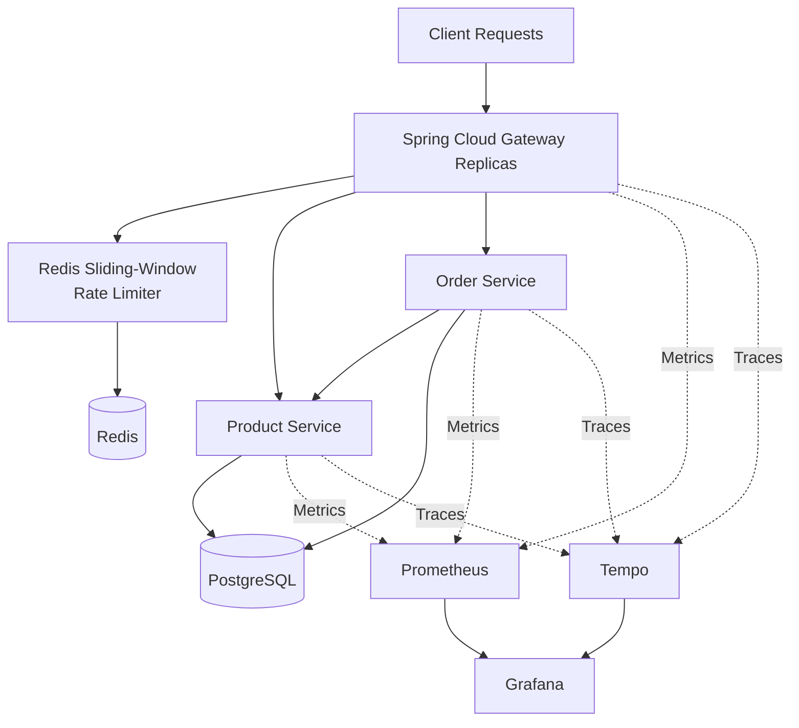
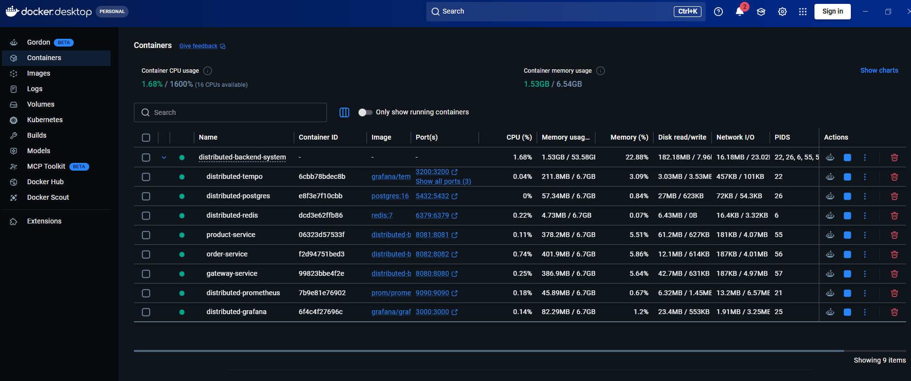
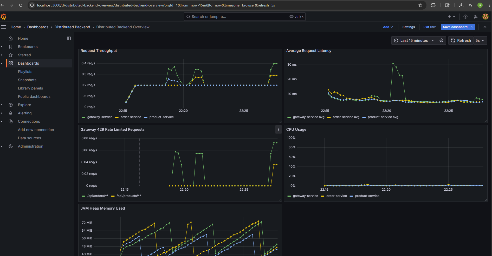
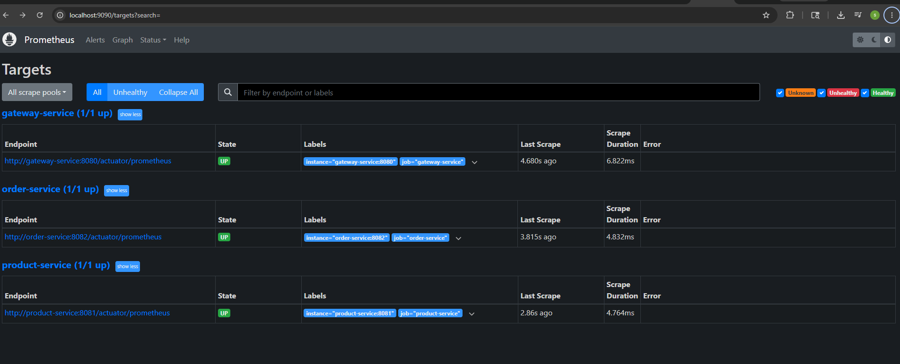
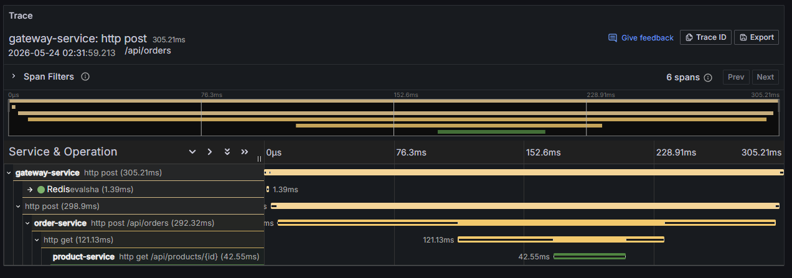

# Observable Distributed Backend System

A Dockerized multi-service backend demonstrating distributed gateway replication, shared Redis rate limiting, PostgreSQL persistence, metrics, and distributed tracing.

---

# Architecture



---

# Tech Stack

* Java 21
* Spring Boot
* Spring Cloud Gateway
* Redis
* PostgreSQL
* Docker & Docker Compose
* Micrometer
* Prometheus
* Grafana
* OpenTelemetry
* Grafana Tempo
* k6

---

# Key Features

## Distributed Gateway Replication

`gateway-service` is stateless and can be scaled with Docker Compose. Each replica routes product and order traffic while sharing the same Redis-backed rate-limit state.

## Shared Redis Rate Limiting

The gateway implements a distributed sliding-window rate limiter with Redis sorted sets and an atomic Lua script.

* shared counters across gateway replicas
* client-IP-based request budgets
* HTTP `429` responses when limits are exceeded
* rate-limit metrics for monitoring

## Services

### Gateway Service

* request routing
* replicated stateless instances
* shared Redis rate limiting

### Product Service

* product and inventory APIs
* PostgreSQL persistence

### Order Service

* order APIs
* product-service integration
* PostgreSQL persistence

---

# Request Flow

```text
Client
  -> Gateway Replica
      -> Product Service -> PostgreSQL
      -> Order Service   -> PostgreSQL
          -> Product Service

Gateway Replicas
  -> Redis
```

---

# Observability

Prometheus scrapes service metrics, including Docker DNS-discovered gateway replicas. Grafana dashboards expose request throughput, latency, JVM metrics, gateway traffic, and rate-limited requests.

OpenTelemetry traces flow from the services to Grafana Tempo and are available through Grafana for cross-service request inspection.

---

# Load Testing

k6 scripts cover product requests, order requests, and rate-limit bursts across replicated gateways:

* `load-tests/products-load-test.js`
* `load-tests/orders-load-test.js`
* `load-tests/rate-limit-burst-test.js`

---

# Local Setup

```bash
docker compose up --build --scale gateway-service=3 -d
```

Use `docker compose ps gateway-service` to inspect the Docker-assigned host ports for gateway replicas.

---

# Ports

| Service           | Published Port |
| ----------------- | -------------- |
| Gateway Replica(s)| Docker-assigned host port to container port `8080` |
| Product Service   | 8081 |
| Order Service     | 8082 |
| PostgreSQL        | 5432 |
| Redis             | 6379 |
| Tempo             | 3200 |
| Prometheus        | 9090 |
| Grafana           | 3000 |

---

# Screenshots

## Docker Containers



## Grafana Dashboard



## Prometheus Targets



## Distributed Traces



---

# Deployment

AWS EC2 deployment notes are available in [deployment/ec2-deployment.md](deployment/ec2-deployment.md).

---

# Engineering Concepts Demonstrated

* distributed coordination with Redis
* stateless gateway replication
* service-to-service communication
* PostgreSQL-backed services
* metrics and distributed tracing
* Docker Compose service orchestration
* k6 load testing
