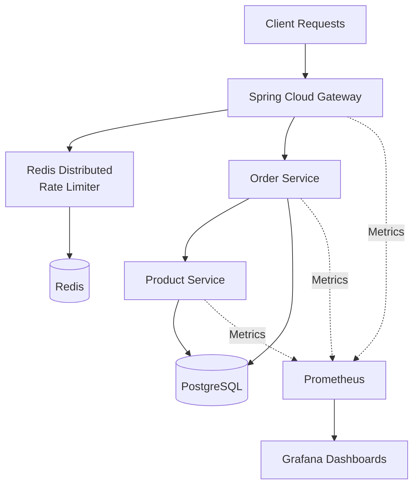

# Observable Distributed Backend System

A production-style distributed backend system built to demonstrate:

* distributed Redis-based rate limiting
* API gateway architecture
* service-to-service communication
* PostgreSQL persistence
* observability with Prometheus and Grafana
* Dockerized infrastructure

---

# Architecture



---

# Tech Stack

* Java 21
* Spring Boot
* Spring Cloud Gateway
* Redis
* PostgreSQL
* Docker & Docker Compose
* Micrometer
* Prometheus
* Grafana
* OpenTelemetry (WIP)

---

# Key Features

## Custom Distributed Rate Limiter

Implemented a manual sliding-window distributed rate limiter using Redis ZSETs.

Features:

* centralized distributed state
* HTTP 429 handling
* gateway-level throttling
* scalable stateless design
* low-cardinality observability tags

---

## Services

### Gateway Service

* request routing
* Redis rate limiting
* centralized observability

### Product Service

* product APIs
* inventory management
* PostgreSQL persistence

### Order Service

* order APIs
* service-to-service communication
* PostgreSQL persistence

---

# Request Flow

```text
Client
  -> Gateway
      -> Order Service
          -> Product Service
              -> PostgreSQL
```

---

# Observability

Metrics collected:

* request throughput
* request latency
* JVM metrics
* gateway traffic
* rate-limited requests

Distributed tracing instrumentation with OpenTelemetry is currently in progress.

---

# Screenshots

## Dockerized Infrastructure


---

## Grafana Dashboard


---

## Prometheus Targets


---

# Local Setup

```bash
docker compose up --build
```

---

# Ports

| Service         | Port |
| --------------- | ---- |
| Gateway Service | 8080 |
| Product Service | 8081 |
| Order Service   | 8082 |
| PostgreSQL      | 5432 |
| Redis           | 6379 |
| Prometheus      | 9090 |
| Grafana         | 3000 |

---

# Example API Calls

## Create Product

```bash
curl -X POST http://localhost:8080/api/products \
-H "Content-Type: application/json" \
-d '{
  "name": "Laptop",
  "price": 50000,
  "inventory": 10
}'
```

## Create Order

```bash
curl -X POST http://localhost:8080/api/orders \
-H "Content-Type: application/json" \
-d '{
  "productId": 1,
  "quantity": 1
}'
```

---

# Engineering Concepts Demonstrated

* distributed systems design
* Redis distributed coordination
* API gateway architecture
* observability engineering
* service-to-service communication
* Docker networking
* scalable backend design
