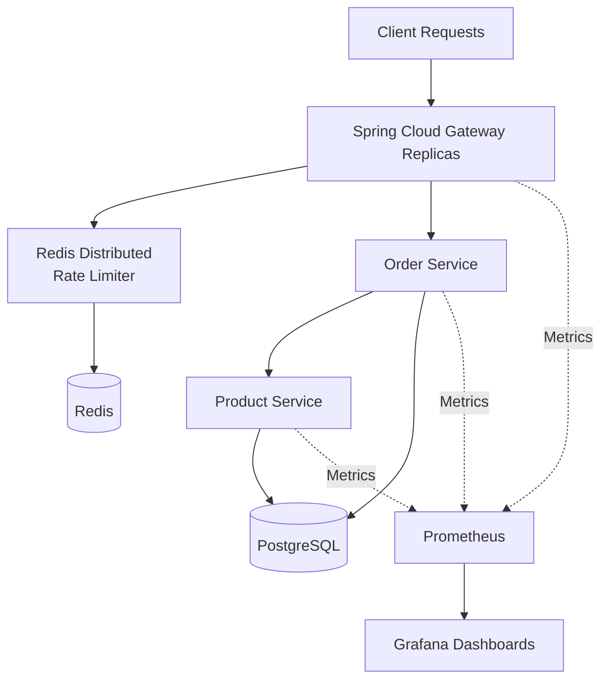

# Observable Distributed Backend System

A production-style distributed backend system built to demonstrate:

* distributed Redis-based rate limiting
* API gateway architecture
* service-to-service communication
* PostgreSQL persistence
* observability with Prometheus and Grafana
* Dockerized infrastructure

---

# Architecture



---

# Tech Stack

* Java 21
* Spring Boot
* Spring Cloud Gateway
* Redis
* PostgreSQL
* Docker & Docker Compose
* Micrometer
* Prometheus
* Grafana
* OpenTelemetry (WIP)

---

# Key Features

## Custom Distributed Rate Limiter

Implemented a manual sliding-window distributed rate limiter using Redis ZSETs.

Features:

* centralized distributed state
* HTTP 429 handling
* gateway-level throttling
* scalable stateless design
* low-cardinality observability tags

---

## Services

### Gateway Service

* request routing
* Redis rate limiting
* centralized observability

### Product Service

* product APIs
* inventory management
* PostgreSQL persistence

### Order Service

* order APIs
* service-to-service communication
* PostgreSQL persistence

---

# Request Flow

```text
Client
  -> Gateway
      -> Order Service
          -> Product Service
              -> PostgreSQL
```

---

# Observability

Metrics collected:

* request throughput
* request latency
* JVM metrics
* gateway traffic
* rate-limited requests

Distributed tracing instrumentation with OpenTelemetry is currently in progress.

---

# Screenshots

## Dockerized Infrastructure


---

## Grafana Dashboard


---

## Prometheus Targets


---

# Local Setup

```bash
docker compose up --build
```

---

# Replicated Gateway

Start three stateless gateway instances with Docker Compose:

```bash
docker compose up --build --scale gateway-service=3 -d
```

`gateway-service` has no fixed container name or fixed host port, so Compose can create multiple identical containers. Because no load balancer is added, Docker publishes an available host port for each replica; inspect the direct endpoints with:

```bash
docker compose ps gateway-service
docker compose port gateway-service 8080 --index 1
docker compose port gateway-service 8080 --index 2
docker compose port gateway-service 8080 --index 3
```

Every gateway is configured with `SPRING_REDIS_HOST=redis` and executes the same atomic Redis Lua sliding-window check. Rate-limit counters are stored as Redis sorted sets keyed by client IP, rather than in a gateway process, so a request through any replica consumes the same five-requests-per-minute budget.

Prometheus uses Docker DNS discovery for `gateway-service` and refreshes its targets every five seconds. After startup, the Prometheus targets page should show three healthy targets for the `gateway-service` job.

## Validate Distributed Rate Limiting

The following test sends six requests with the same client identity across all three direct gateway endpoints:

```bash
GW1=$(docker compose port gateway-service 8080 --index 1 | sed 's/.*://')
GW2=$(docker compose port gateway-service 8080 --index 2 | sed 's/.*://')
GW3=$(docker compose port gateway-service 8080 --index 3 | sed 's/.*://')

for port in "$GW1" "$GW2" "$GW3" "$GW1" "$GW2" "$GW3"; do
  curl -s -o /dev/null -w "%{http_code}\n" \
    -H "X-Forwarded-For: 203.0.113.10" \
    "http://localhost:${port}/api/products"
done
```

The first five requests pass through the gateways; the sixth returns `429` even though no single replica handled five requests. This verifies that limiter state is centralized in Redis. Use a different `X-Forwarded-For` value or wait one minute before repeating the test.

---

# Ports

| Service          | Published Port |
| ---------------- | -------------- |
| Gateway Replica(s)| Docker-assigned host port to container port `8080` |
| Product Service  | 8081 |
| Order Service    | 8082 |
| PostgreSQL       | 5432 |
| Redis            | 6379 |
| Prometheus       | 9090 |
| Grafana          | 3000 |

---

# Example API Calls

First resolve the published host port for a gateway replica:

```bash
GATEWAY_PORT=$(docker compose port gateway-service 8080 --index 1 | sed 's/.*://')
```

## Create Product

```bash
curl -X POST "http://localhost:${GATEWAY_PORT}/api/products" \
-H "Content-Type: application/json" \
-d '{
  "name": "Laptop",
  "price": 50000,
  "inventory": 10
}'
```

## Create Order

```bash
curl -X POST "http://localhost:${GATEWAY_PORT}/api/orders" \
-H "Content-Type: application/json" \
-d '{
  "productId": 1,
  "quantity": 1
}'
```

---

# Engineering Concepts Demonstrated

* distributed systems design
* Redis distributed coordination
* API gateway architecture
* observability engineering
* service-to-service communication
* Docker networking
* scalable backend design
