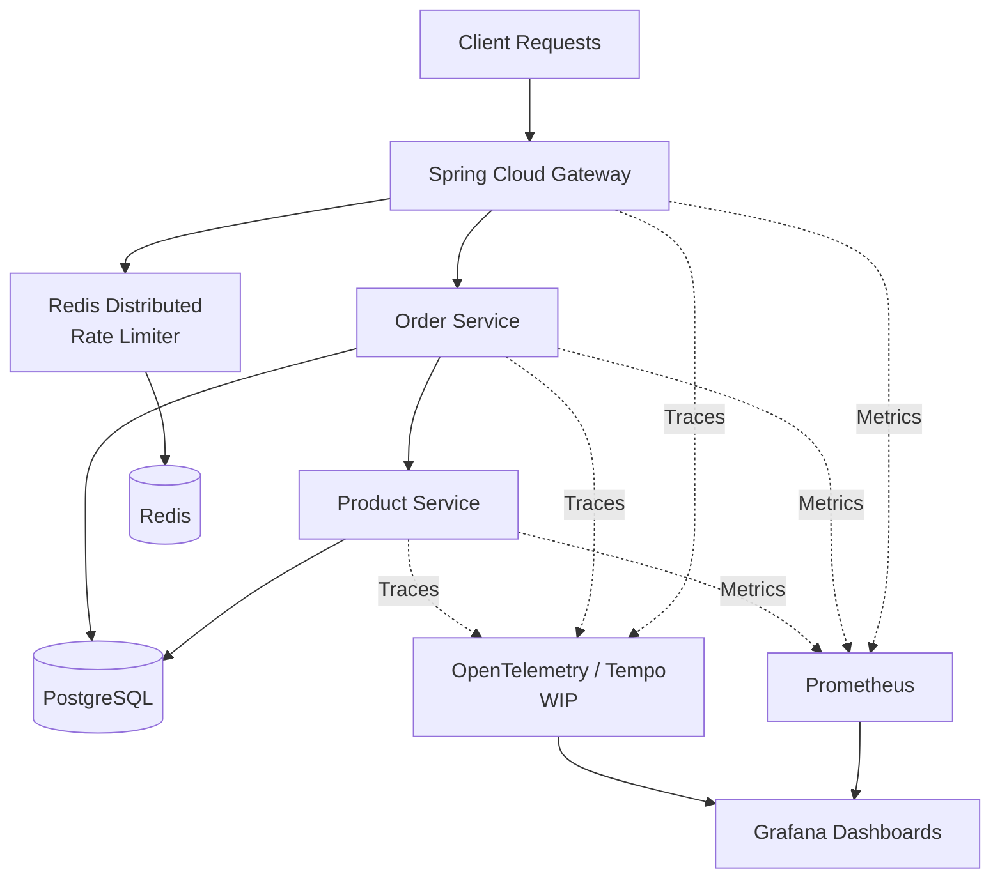

# Observable Distributed Backend System

A production-style distributed backend system demonstrating:

* centralized Redis-based distributed rate limiting
* API gateway architecture
* service-to-service communication
* PostgreSQL persistence
* observability with Prometheus and Grafana
* Dockerized infrastructure
* scalable backend design principles

---

# Architecture



## Request Flow

```text
Client
  -> Gateway
      -> Order Service
          -> Product Service
              -> PostgreSQL
```

---

# Tech Stack

| Category               | Technologies                    |
| ---------------------- | ------------------------------- |
| Backend                | Java 21, Spring Boot            |
| Gateway                | Spring Cloud Gateway            |
| Database               | PostgreSQL                      |
| Distributed State      | Redis                           |
| Observability          | Micrometer, Prometheus, Grafana |
| Tracing                | OpenTelemetry (WIP)             |
| Containerization       | Docker, Docker Compose          |
| Build Tool             | Maven                           |
| Load Testing (Planned) | JMeter                          |

---

# Key Features

## Distributed Redis-Based Rate Limiting

A custom distributed sliding-window rate limiter was implemented manually using Redis sorted sets (ZSETs).

Instead of relying on a built-in gateway rate limiter, the project implements the rate limiting algorithm directly to demonstrate distributed systems coordination and backend traffic engineering concepts.

Key implementation details:

* centralized distributed state using Redis
* sliding-window algorithm using Redis ZSETs
* atomic request tracking per client/window
* HTTP 429 handling
* scalable stateless gateway architecture
* distributed coordination across gateway instances
* low-cardinality observability design

The limiter works by:

1. storing request timestamps in Redis sorted sets
2. removing expired timestamps from the active window
3. counting active requests inside the time window
4. allowing or rejecting requests based on configured thresholds

This architecture enables multiple gateway instances to share a globally consistent rate limit state through Redis.

Example Redis flow:

```text
Gateway Service
      |
Redis Sliding Window Limiter
      |
Allow / Reject Request
```

---

## API Gateway Architecture

The system uses Spring Cloud Gateway as the centralized entry point.

Responsibilities:

* request routing
* Redis rate limiting
* observability entry point
* centralized metrics collection
* distributed systems coordination

---

## Microservice Communication

The system is split into focused backend services:

### Product Service

Handles:

* products
* inventory
* PostgreSQL persistence

### Order Service

Handles:

* order creation
* order retrieval
* communication with Product Service

Request Flow:

```text
Client
  -> Gateway
      -> Order Service
          -> Product Service
              -> PostgreSQL
```

---

## PostgreSQL Persistence

The backend uses PostgreSQL for persistent storage.

### Products Table

```text
products
---------
id
name
price
inventory
```

### Orders Table

```text
orders
---------
id
product_id
quantity
created_at
```

---

# Observability

## Prometheus Metrics

All services expose:

```text
/actuator/prometheus
```

Metrics collected include:

* request throughput
* request latency
* rate-limited requests
* JVM memory
* CPU usage
* gateway traffic

---

## Grafana Dashboards

Grafana dashboards visualize:

* API traffic
* latency trends
* Redis rate limiting behavior
* JVM metrics
* service performance

The system follows production-style observability practices by avoiding high-cardinality metric labels.

Example route grouping:

```text
/api/products/**
/api/orders/**
/api/**
```

instead of dynamic IDs or client IPs.

---

# Distributed Tracing (Work In Progress)

OpenTelemetry instrumentation has been integrated as part of ongoing work toward distributed request tracing.

Goal:

```text
Gateway Service
   -> Order Service
       -> Product Service
```

as a single distributed trace.

---

# Dockerized Infrastructure

The entire system runs using Docker Compose.

Services:

* gateway-service
* product-service
* order-service
* postgres
* redis
* prometheus
* grafana

---

# Local Setup

## Prerequisites

Install:

* Java 21
* Docker Desktop
* Maven

---

## Start the System

From the project root:

```bash
docker compose up --build
```

---

# Service Ports

| Service         | Port |
| --------------- | ---- |
| Gateway Service | 8080 |
| Product Service | 8081 |
| Order Service   | 8082 |
| PostgreSQL      | 5432 |
| Redis           | 6379 |
| Prometheus      | 9090 |
| Grafana         | 3000 |

---

# Example API Calls

## Create Product

```bash
curl -X POST http://localhost:8080/api/products \
-H "Content-Type: application/json" \
-d '{
  "name": "Laptop",
  "price": 50000,
  "inventory": 10
}'
```

---

## Get Products

```bash
curl http://localhost:8080/api/products
```

---

## Create Order

```bash
curl -X POST http://localhost:8080/api/orders \
-H "Content-Type: application/json" \
-d '{
  "productId": 1,
  "quantity": 1
}'
```

---

# Monitoring

## Prometheus

Open:

```text
http://localhost:9090
```

Targets:

```text
http://localhost:9090/targets
```

---

## Grafana

Open:

```text
http://localhost:3000
```

Default credentials:

```text
admin / admin
```

---

# Engineering Concepts Demonstrated

This project demonstrates:

* distributed systems design
* centralized rate limiting
* API gateway architecture
* service-to-service communication
* observability engineering
* metrics monitoring
* Docker networking
* scalable backend design
* production-style backend infrastructure

---

# Future Improvements

Planned enhancements:

* fully operational OpenTelemetry tracing
* JMeter load testing
* gateway replication
* distributed trace visualization
* performance benchmarking

---

# This project focuses on

* distributed coordination
* observability
* backend infrastructure
* scalability
* traffic engineering
* production-style monitoring

The goal was to build a realistic backend engineering system that reflects modern distributed backend architecture principles.
